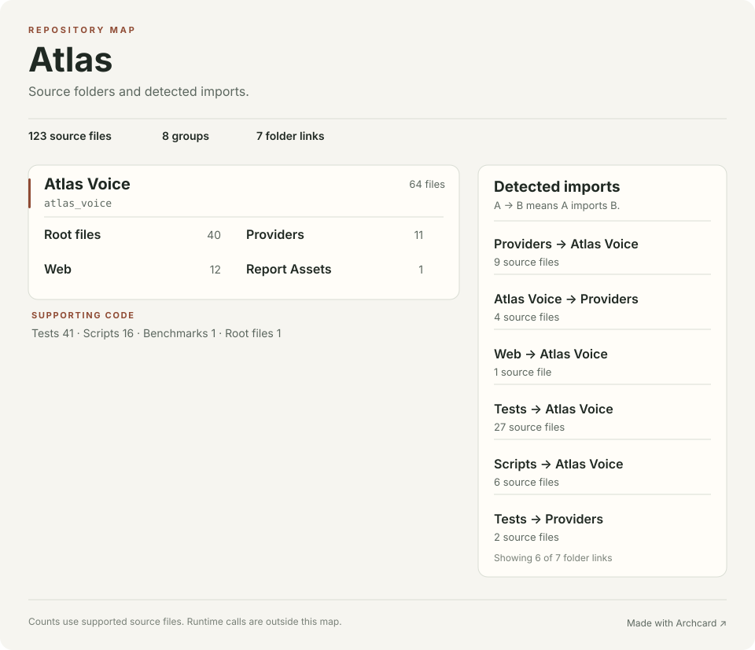

# Atlas source map

This map comes from source files. An arrow means that one local file imports another. It does not show runtime calls, network traffic, or deployments.

123 source files · 8 groups · 190 direct local file imports

## Folder imports

Each count is the number of source files in the first folder that import from the second folder.

| From | Imports | Source files |
| --- | --- | ---: |
| tests | atlas_voice | 27 |
| atlas_voice/providers | atlas_voice | 9 |
| scripts | atlas_voice | 6 |
| atlas_voice | atlas_voice/providers | 4 |
| tests | atlas_voice/providers | 2 |
| tests | atlas_voice/web | 2 |
| atlas_voice/web | atlas_voice | 1 |

## Source files

### atlas_voice

#### atlas_voice

40 files · Python

| File | Direct local imports |
| --- | --- |
| [__init__.py](../atlas_voice/__init__.py) | — |
| [ambient.py](../atlas_voice/ambient.py) | [audio.py](../atlas_voice/audio.py), [config.py](../atlas_voice/config.py), [database.py](../atlas_voice/database.py), [providers/asr.py](../atlas_voice/providers/asr.py), [providers/vad.py](../atlas_voice/providers/vad.py), [realtime.py](../atlas_voice/realtime.py), [storage.py](../atlas_voice/storage.py) |
| [anythingllm.py](../atlas_voice/anythingllm.py) | [config.py](../atlas_voice/config.py), [database.py](../atlas_voice/database.py), [exporter.py](../atlas_voice/exporter.py), [merge.py](../atlas_voice/merge.py) |
| [assistant_config.py](../atlas_voice/assistant_config.py) | [voice_profiles.py](../atlas_voice/voice_profiles.py) |
| [audio.py](../atlas_voice/audio.py) | — |
| [benchmark.py](../atlas_voice/benchmark.py) | [assistant_config.py](../atlas_voice/assistant_config.py), [audio.py](../atlas_voice/audio.py), [config.py](../atlas_voice/config.py), [profile_settings.py](../atlas_voice/profile_settings.py), [providers/asr.py](../atlas_voice/providers/asr.py), [providers/diarization.py](../atlas_voice/providers/diarization.py), [providers/nemo_provider.py](../atlas_voice/providers/nemo_provider.py), [providers/pyannote_provider.py](../atlas_voice/providers/pyannote_provider.py), [providers/transcript_utils.py](../atlas_voice/providers/transcript_utils.py), [providers/whisperx_provider.py](../atlas_voice/providers/whisperx_provider.py), [quality.py](../atlas_voice/quality.py) |
| [blinded_quality_review.py](../atlas_voice/blinded_quality_review.py) | [model_benchmark.py](../atlas_voice/model_benchmark.py), [quality_corpus.py](../atlas_voice/quality_corpus.py) |
| [cli.py](../atlas_voice/cli.py) | [anythingllm.py](../atlas_voice/anythingllm.py), [assistant_config.py](../atlas_voice/assistant_config.py), [config.py](../atlas_voice/config.py), [database.py](../atlas_voice/database.py), [exporter.py](../atlas_voice/exporter.py), [pipeline.py](../atlas_voice/pipeline.py), [privacy.py](../atlas_voice/privacy.py), [profile_settings.py](../atlas_voice/profile_settings.py), [resources.py](../atlas_voice/resources.py), [retention.py](../atlas_voice/retention.py), [storage.py](../atlas_voice/storage.py), [tts_validation.py](../atlas_voice/tts_validation.py), [worker.py](../atlas_voice/worker.py) |
| [coaching.py](../atlas_voice/coaching.py) | [database.py](../atlas_voice/database.py) |
| [config.py](../atlas_voice/config.py) | — |
| [database.py](../atlas_voice/database.py) | — |
| [exporter.py](../atlas_voice/exporter.py) | [database.py](../atlas_voice/database.py), [merge.py](../atlas_voice/merge.py) |
| [llama_bench_wrapper.py](../atlas_voice/llama_bench_wrapper.py) | — |
| [memory.py](../atlas_voice/memory.py) | [database.py](../atlas_voice/database.py) |
| [merge.py](../atlas_voice/merge.py) | — |
| [model_benchmark.py](../atlas_voice/model_benchmark.py) | [quality_corpus.py](../atlas_voice/quality_corpus.py) |
| [model_benchmark_report.py](../atlas_voice/model_benchmark_report.py) | — |
| [model_installer.py](../atlas_voice/model_installer.py) | — |
| [pipeline.py](../atlas_voice/pipeline.py) | [anythingllm.py](../atlas_voice/anythingllm.py), [audio.py](../atlas_voice/audio.py), [config.py](../atlas_voice/config.py), [database.py](../atlas_voice/database.py), [merge.py](../atlas_voice/merge.py), [providers/asr.py](../atlas_voice/providers/asr.py), [providers/diarization.py](../atlas_voice/providers/diarization.py), [quality.py](../atlas_voice/quality.py), [resources.py](../atlas_voice/resources.py), [storage.py](../atlas_voice/storage.py), [titles.py](../atlas_voice/titles.py) |
| [privacy.py](../atlas_voice/privacy.py) | [assistant_config.py](../atlas_voice/assistant_config.py), [config.py](../atlas_voice/config.py) |
| [profile_settings.py](../atlas_voice/profile_settings.py) | [assistant_config.py](../atlas_voice/assistant_config.py), [config.py](../atlas_voice/config.py), [voice_profiles.py](../atlas_voice/voice_profiles.py) |
| [prompts.py](../atlas_voice/prompts.py) | [assistant_config.py](../atlas_voice/assistant_config.py) |
| [quality.py](../atlas_voice/quality.py) | [config.py](../atlas_voice/config.py) |
| [quality_corpus.py](../atlas_voice/quality_corpus.py) | — |
| [quality_postprocessor.py](../atlas_voice/quality_postprocessor.py) | [quality_corpus.py](../atlas_voice/quality_corpus.py) |
| [realtime.py](../atlas_voice/realtime.py) | [config.py](../atlas_voice/config.py), [providers/asr.py](../atlas_voice/providers/asr.py) |
| [resources.py](../atlas_voice/resources.py) | [quality.py](../atlas_voice/quality.py) |
| [retention.py](../atlas_voice/retention.py) | [config.py](../atlas_voice/config.py), [database.py](../atlas_voice/database.py) |
| [retrieval.py](../atlas_voice/retrieval.py) | — |
| [status.py](../atlas_voice/status.py) | [assistant_config.py](../atlas_voice/assistant_config.py), [config.py](../atlas_voice/config.py), [database.py](../atlas_voice/database.py), [privacy.py](../atlas_voice/privacy.py), [profile_settings.py](../atlas_voice/profile_settings.py), [realtime.py](../atlas_voice/realtime.py) |
| [storage.py](../atlas_voice/storage.py) | [config.py](../atlas_voice/config.py), [database.py](../atlas_voice/database.py) |
| [summarizer.py](../atlas_voice/summarizer.py) | [config.py](../atlas_voice/config.py), [merge.py](../atlas_voice/merge.py) |
| [titles.py](../atlas_voice/titles.py) | [config.py](../atlas_voice/config.py), [summarizer.py](../atlas_voice/summarizer.py) |
| [tools.py](../atlas_voice/tools.py) | [assistant_config.py](../atlas_voice/assistant_config.py) |
| [tts_sidecar.py](../atlas_voice/tts_sidecar.py) | — |
| [tts_validation.py](../atlas_voice/tts_validation.py) | [config.py](../atlas_voice/config.py) |
| [turn_state.py](../atlas_voice/turn_state.py) | — |
| [voice_profiles.py](../atlas_voice/voice_profiles.py) | [assistant_config.py](../atlas_voice/assistant_config.py), [quality.py](../atlas_voice/quality.py) |
| [web_search.py](../atlas_voice/web_search.py) | [config.py](../atlas_voice/config.py) |
| [worker.py](../atlas_voice/worker.py) | [config.py](../atlas_voice/config.py), [database.py](../atlas_voice/database.py), [pipeline.py](../atlas_voice/pipeline.py), [storage.py](../atlas_voice/storage.py) |

#### atlas_voice/web

12 files · HTML

| File | Direct local imports |
| --- | --- |
| [__init__.py](../atlas_voice/web/__init__.py) | — |
| [app.py](../atlas_voice/web/app.py) | [atlas_voice/assistant_config.py](../atlas_voice/assistant_config.py), [atlas_voice/config.py](../atlas_voice/config.py), [atlas_voice/database.py](../atlas_voice/database.py), [atlas_voice/exporter.py](../atlas_voice/exporter.py), [atlas_voice/merge.py](../atlas_voice/merge.py), [atlas_voice/pipeline.py](../atlas_voice/pipeline.py), [atlas_voice/privacy.py](../atlas_voice/privacy.py), [atlas_voice/quality.py](../atlas_voice/quality.py), [atlas_voice/retrieval.py](../atlas_voice/retrieval.py), [atlas_voice/status.py](../atlas_voice/status.py), [atlas_voice/storage.py](../atlas_voice/storage.py), [atlas_voice/summarizer.py](../atlas_voice/summarizer.py), [atlas_voice/tools.py](../atlas_voice/tools.py), [atlas_voice/turn_state.py](../atlas_voice/turn_state.py) |
| [app.css](../atlas_voice/web/static/app.css) | — |
| [design-system.css](../atlas_voice/web/static/design-system.css) | — |
| [recordings.js](../atlas_voice/web/static/recordings.js) | — |
| [voice.js](../atlas_voice/web/static/voice.js) | — |
| [base.html](../atlas_voice/web/templates/base.html) | — |
| [index.html](../atlas_voice/web/templates/index.html) | — |
| [recording.html](../atlas_voice/web/templates/recording.html) | — |
| [recordings.html](../atlas_voice/web/templates/recordings.html) | — |
| [search.html](../atlas_voice/web/templates/search.html) | — |
| [voice.html](../atlas_voice/web/templates/voice.html) | — |

#### atlas_voice/providers

11 files · Python

| File | Direct local imports |
| --- | --- |
| [__init__.py](../atlas_voice/providers/__init__.py) | — |
| [asr.py](../atlas_voice/providers/asr.py) | [atlas_voice/config.py](../atlas_voice/config.py), [faster_whisper_provider.py](../atlas_voice/providers/faster_whisper_provider.py), [nemo_provider.py](../atlas_voice/providers/nemo_provider.py), [vibevoice_provider.py](../atlas_voice/providers/vibevoice_provider.py), [whisperx_provider.py](../atlas_voice/providers/whisperx_provider.py) |
| [diarization.py](../atlas_voice/providers/diarization.py) | [atlas_voice/config.py](../atlas_voice/config.py), [pyannote_provider.py](../atlas_voice/providers/pyannote_provider.py) |
| [faster_whisper_provider.py](../atlas_voice/providers/faster_whisper_provider.py) | [atlas_voice/config.py](../atlas_voice/config.py), [whisperx_provider.py](../atlas_voice/providers/whisperx_provider.py) |
| [hyprwhspr_provider.py](../atlas_voice/providers/hyprwhspr_provider.py) | [atlas_voice/config.py](../atlas_voice/config.py) |
| [nemo_provider.py](../atlas_voice/providers/nemo_provider.py) | [atlas_voice/config.py](../atlas_voice/config.py), [transcript_utils.py](../atlas_voice/providers/transcript_utils.py) |
| [pyannote_provider.py](../atlas_voice/providers/pyannote_provider.py) | [atlas_voice/config.py](../atlas_voice/config.py) |
| [transcript_utils.py](../atlas_voice/providers/transcript_utils.py) | — |
| [vad.py](../atlas_voice/providers/vad.py) | [atlas_voice/config.py](../atlas_voice/config.py) |
| [vibevoice_provider.py](../atlas_voice/providers/vibevoice_provider.py) | [atlas_voice/config.py](../atlas_voice/config.py), [transcript_utils.py](../atlas_voice/providers/transcript_utils.py) |
| [whisperx_provider.py](../atlas_voice/providers/whisperx_provider.py) | [atlas_voice/config.py](../atlas_voice/config.py) |

#### atlas_voice/report_assets

1 file · HTML

| File | Direct local imports |
| --- | --- |
| [voice_model_report_shell.html](../atlas_voice/report_assets/voice_model_report_shell.html) | — |

### benchmarks

#### benchmarks

1 file · Python

| File | Direct local imports |
| --- | --- |
| [build_voice_model_quality_context.py](../benchmarks/build_voice_model_quality_context.py) | — |

### root

#### .

1 file · Shell

| File | Direct local imports |
| --- | --- |
| [setup.sh](../setup.sh) | — |

### scripts

#### scripts

16 files · Shell

| File | Direct local imports |
| --- | --- |
| [benchmark-llama-model.py](../scripts/benchmark-llama-model.py) | [atlas_voice/llama_bench_wrapper.py](../atlas_voice/llama_bench_wrapper.py) |
| [benchmark-voice-models.py](../scripts/benchmark-voice-models.py) | [atlas_voice/model_benchmark.py](../atlas_voice/model_benchmark.py) |
| [build-voice-model-report.py](../scripts/build-voice-model-report.py) | [atlas_voice/model_benchmark_report.py](../atlas_voice/model_benchmark_report.py) |
| [check-open-source-ready.sh](../scripts/check-open-source-ready.sh) | — |
| [install-autostart.sh](../scripts/install-autostart.sh) | — |
| [install-experimental-asr.sh](../scripts/install-experimental-asr.sh) | — |
| [install-gpu-venv.sh](../scripts/install-gpu-venv.sh) | — |
| [install-qwen-tts.sh](../scripts/install-qwen-tts.sh) | — |
| [install-voice-models.py](../scripts/install-voice-models.py) | [atlas_voice/model_installer.py](../atlas_voice/model_installer.py) |
| [review-voice-model-quality.py](../scripts/review-voice-model-quality.py) | [atlas_voice/blinded_quality_review.py](../atlas_voice/blinded_quality_review.py) |
| [run-local-service.sh](../scripts/run-local-service.sh) | — |
| [score-voice-model-quality.py](../scripts/score-voice-model-quality.py) | [atlas_voice/quality_postprocessor.py](../atlas_voice/quality_postprocessor.py) |
| [smoke-benchmark-asr.sh](../scripts/smoke-benchmark-asr.sh) | — |
| [start-local.sh](../scripts/start-local.sh) | — |
| [status-local.sh](../scripts/status-local.sh) | — |
| [stop-local.sh](../scripts/stop-local.sh) | — |

### tests

#### tests

41 files · Python

| File | Direct local imports |
| --- | --- |
| [test_ambient.py](../tests/test_ambient.py) | [atlas_voice/cli.py](../atlas_voice/cli.py), [atlas_voice/config.py](../atlas_voice/config.py), [atlas_voice/database.py](../atlas_voice/database.py) |
| [test_anythingllm.py](../tests/test_anythingllm.py) | [atlas_voice/config.py](../atlas_voice/config.py), [atlas_voice/database.py](../atlas_voice/database.py) |
| [test_audio.py](../tests/test_audio.py) | [atlas_voice/audio.py](../atlas_voice/audio.py) |
| [test_blinded_quality_review.py](../tests/test_blinded_quality_review.py) | — |
| [test_coaching.py](../tests/test_coaching.py) | [atlas_voice/database.py](../atlas_voice/database.py) |
| [test_config.py](../tests/test_config.py) | [atlas_voice/assistant_config.py](../atlas_voice/assistant_config.py), [atlas_voice/config.py](../atlas_voice/config.py), [atlas_voice/profile_settings.py](../atlas_voice/profile_settings.py), [atlas_voice/prompts.py](../atlas_voice/prompts.py), [atlas_voice/tools.py](../atlas_voice/tools.py) |
| [test_database.py](../tests/test_database.py) | [atlas_voice/database.py](../atlas_voice/database.py) |
| [test_experimental_providers.py](../tests/test_experimental_providers.py) | [atlas_voice/benchmark.py](../atlas_voice/benchmark.py), [atlas_voice/config.py](../atlas_voice/config.py), [providers/diarization.py](../atlas_voice/providers/diarization.py), [providers/faster_whisper_provider.py](../atlas_voice/providers/faster_whisper_provider.py), [providers/nemo_provider.py](../atlas_voice/providers/nemo_provider.py) |
| [test_focused_retrieval.py](../tests/test_focused_retrieval.py) | [atlas_voice/retrieval.py](../atlas_voice/retrieval.py) |
| [test_llama_bench_wrapper.py](../tests/test_llama_bench_wrapper.py) | — |
| [test_local_llm_service.py](../tests/test_local_llm_service.py) | — |
| [test_memory.py](../tests/test_memory.py) | [atlas_voice/database.py](../atlas_voice/database.py) |
| [test_merge.py](../tests/test_merge.py) | — |
| [test_model_benchmark.py](../tests/test_model_benchmark.py) | — |
| [test_model_benchmark_quality_integration.py](../tests/test_model_benchmark_quality_integration.py) | [atlas_voice/model_benchmark.py](../atlas_voice/model_benchmark.py) |
| [test_model_benchmark_report.py](../tests/test_model_benchmark_report.py) | — |
| [test_model_installer.py](../tests/test_model_installer.py) | — |
| [test_model_router_inventory.py](../tests/test_model_router_inventory.py) | — |
| [test_pipeline.py](../tests/test_pipeline.py) | [atlas_voice/config.py](../atlas_voice/config.py), [atlas_voice/database.py](../atlas_voice/database.py), [atlas_voice/pipeline.py](../atlas_voice/pipeline.py) |
| [test_privacy.py](../tests/test_privacy.py) | [atlas_voice/assistant_config.py](../atlas_voice/assistant_config.py), [atlas_voice/config.py](../atlas_voice/config.py), [atlas_voice/privacy.py](../atlas_voice/privacy.py) |
| [test_privacy_purge.py](../tests/test_privacy_purge.py) | [atlas_voice/cli.py](../atlas_voice/cli.py), [atlas_voice/config.py](../atlas_voice/config.py), [atlas_voice/database.py](../atlas_voice/database.py) |
| [test_pyannote_provider.py](../tests/test_pyannote_provider.py) | [atlas_voice/config.py](../atlas_voice/config.py), [providers/pyannote_provider.py](../atlas_voice/providers/pyannote_provider.py) |
| [test_quality_benchmark.py](../tests/test_quality_benchmark.py) | [atlas_voice/cli.py](../atlas_voice/cli.py), [atlas_voice/config.py](../atlas_voice/config.py), [atlas_voice/quality.py](../atlas_voice/quality.py) |
| [test_quality_corpus.py](../tests/test_quality_corpus.py) | [atlas_voice/quality_corpus.py](../atlas_voice/quality_corpus.py) |
| [test_quality_features.py](../tests/test_quality_features.py) | [atlas_voice/config.py](../atlas_voice/config.py), [atlas_voice/database.py](../atlas_voice/database.py), [atlas_voice/resources.py](../atlas_voice/resources.py), [atlas_voice/worker.py](../atlas_voice/worker.py) |
| [test_quality_postprocessor.py](../tests/test_quality_postprocessor.py) | — |
| [test_realtime.py](../tests/test_realtime.py) | — |
| [test_realtime_source_context.py](../tests/test_realtime_source_context.py) | [atlas_voice/realtime.py](../atlas_voice/realtime.py), [web/app.py](../atlas_voice/web/app.py), [atlas_voice/web_search.py](../atlas_voice/web_search.py) |
| [test_retention.py](../tests/test_retention.py) | [atlas_voice/config.py](../atlas_voice/config.py), [atlas_voice/database.py](../atlas_voice/database.py), [atlas_voice/retention.py](../atlas_voice/retention.py) |
| [test_storage.py](../tests/test_storage.py) | [atlas_voice/config.py](../atlas_voice/config.py), [atlas_voice/database.py](../atlas_voice/database.py), [atlas_voice/storage.py](../atlas_voice/storage.py) |
| [test_summarizer.py](../tests/test_summarizer.py) | — |
| [test_titles.py](../tests/test_titles.py) | [atlas_voice/titles.py](../atlas_voice/titles.py) |
| [test_tts_sidecar.py](../tests/test_tts_sidecar.py) | — |
| [test_tts_validation.py](../tests/test_tts_validation.py) | [atlas_voice/cli.py](../atlas_voice/cli.py), [atlas_voice/realtime.py](../atlas_voice/realtime.py), [atlas_voice/tts_validation.py](../atlas_voice/tts_validation.py) |
| [test_turn_state.py](../tests/test_turn_state.py) | [atlas_voice/turn_state.py](../atlas_voice/turn_state.py) |
| [test_voice_profiles.py](../tests/test_voice_profiles.py) | [atlas_voice/assistant_config.py](../atlas_voice/assistant_config.py), [atlas_voice/config.py](../atlas_voice/config.py), [atlas_voice/profile_settings.py](../atlas_voice/profile_settings.py) |
| [test_voice_stack_benchmark.py](../tests/test_voice_stack_benchmark.py) | [atlas_voice/benchmark.py](../atlas_voice/benchmark.py), [atlas_voice/cli.py](../atlas_voice/cli.py), [atlas_voice/realtime.py](../atlas_voice/realtime.py) |
| [test_voice_ui.py](../tests/test_voice_ui.py) | — |
| [test_web.py](../tests/test_web.py) | [atlas_voice/realtime.py](../atlas_voice/realtime.py), [atlas_voice/status.py](../atlas_voice/status.py), [web/app.py](../atlas_voice/web/app.py) |
| [test_web_search.py](../tests/test_web_search.py) | [atlas_voice/config.py](../atlas_voice/config.py), [atlas_voice/web_search.py](../atlas_voice/web_search.py) |
| [test_whisperx_provider.py](../tests/test_whisperx_provider.py) | — |

A missing arrow does not prove that two files are independent. Archcard recognizes common JavaScript, TypeScript, Python, and Rust import forms. [Made with Archcard](https://github.com/skipauthenticate/archcard).
